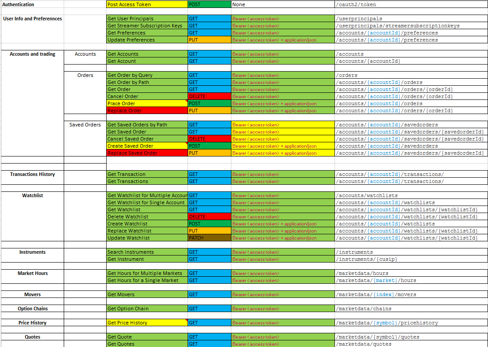

# Ameritrade-Interface
Ameritrade interface to handle Authentication, streaming subscriptions and API requests

TDAuthentication.py:
  Keeps a valid token access to be use by TDAPI(endpoint requests)
  It can be run without any preview setup as it handle different authentication methods. Full Automated where account info will be stored for future authentication or Full Manual where you have to authenticate each 30 min.
  
TDAPI.py:
  Handle all API requests. GET, POST,PUT, PATCH.
  In order to send a valid request it keep authenticating throuh TDAtuthentication Class
  Find below the table with all possible requests.
  
TDAPI-Test.py:
  Has multiple endpoints check for the TDAPI file
  
TDStream.py:
  Handle all subscription. SUBS, UNSUBS, ADD, LOGIN, LOGOUT, QOS
  In order to request the credentials it uses TDAPI Class
  Find below subscription table.
 
TDStreamer-test-py:
  Has multiple subscription method to test TDStream.

TDAPI requests table:

TDStream subscription table:

TDAPI TO DO: 

              Add customized create_order.

              Add DataFrame output so the requester could choose between json and DataFrame.
              
              Add Streaming data handle. As it is most go to SQL database. 
