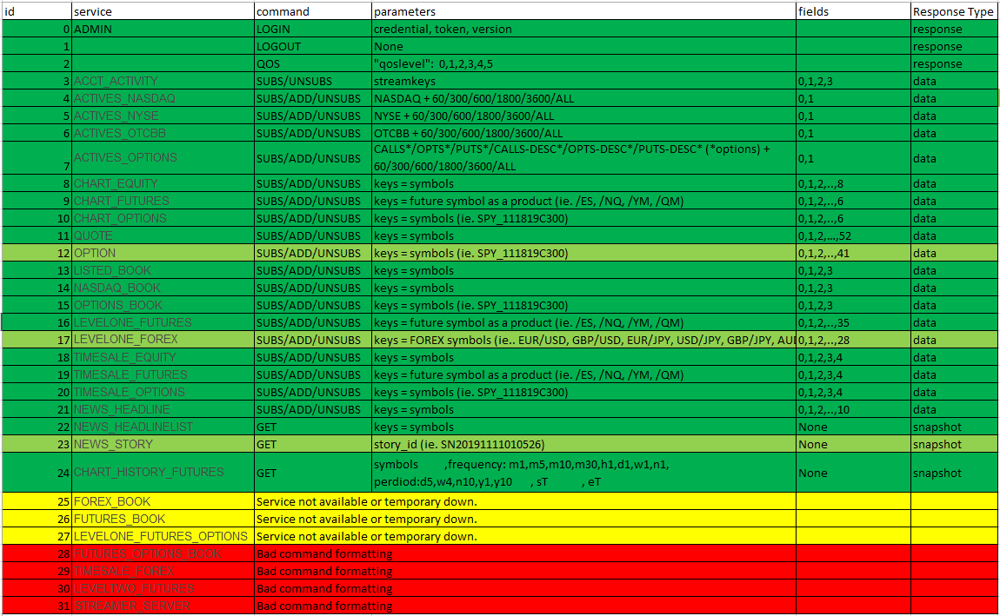

# Ameritrade Python Interface
Handles Authentication, WebSocket streaming subscriptions and API requests

TDAuthentication.py:

    Keeps a valid token access to be used by TDAPI(endpoint requests).
    
    In order to get client_id, redirect_uri you have to register API client at https://developer.tdameritrade.com
    
    There is an explaining video on how to register your API at Ameritrade: https://www.youtube.com/watch?v=qJ94sSyPGBw 
    
    It handles different authentication methods.
    
    Full Automated where account info will be stored for future authentication 
    or Full Manual where you have to authenticate each 30 min.
  
TDAPI.py [Based on areed1192](https://github.com/areed1192/td-ameritrade-python-api):

    Handle all API requests. GET, POST,PUT, PATCH.
  
    In order to send a valid request it keep authenticating throuh TDAtuthentication Class.
  
    Find below the table with all possible requests.
   
 
TDAPI-Test.py:

    Has multiple endpoints check for the TDAPI file.
  
    Customed create orders.
    
    Pandas DataFrame output for each enpoint.
  
TDStream.py:

    Handle all subscription for WebSocket streaming. SUBS, UNSUBS, ADD, LOGIN, LOGOUT, QOS.
  
    In order to request the credentials it uses TDAPI Class.
  
    Find below subscription table.
    
    New feature: Keep alive method that subscribes back all subscription when connection comes alive again.
                CSV storadge. 
                Callback function to trigger observers when new data arrives.
 
TDStreamer-test-py:

    Has multiple subscription method to test TDStream.

TDAPI requests table:

TDStream subscription table:

TO DO: 

    Add DataFrame interface to convert from JSON output.
    Add parameter verification.
             
 
